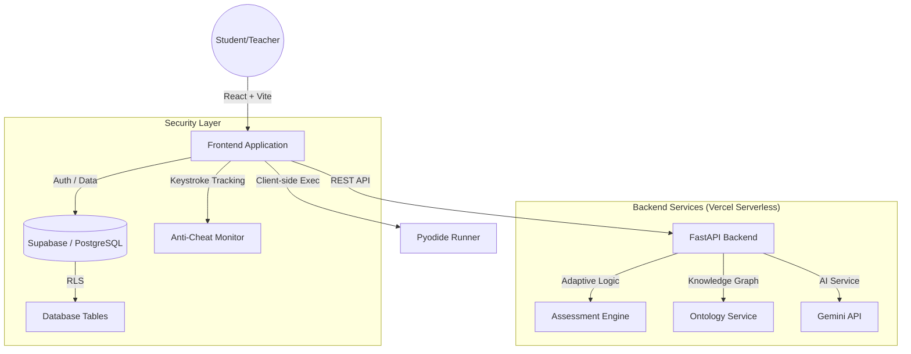

# Architectural Design: CodeCoach

CodeCoach is an AI-powered, adaptive learning platform designed for coding education. It features real-time in-browser code execution, Socratic AI guidance, and an automated assessment engine.

## 🏗️ High-Level System Architecture

## 💻 Frontend Architecture (React / Vite)
- **Framework**: React with TypeScript for type safety.
- **Styling**: Tailwind CSS + Shadcn UI for a premium, responsive interface.
- **State Management**: React Query for efficient data fetching and caching.
- **Code Execution**: **Pyodide**. Code is executed directly in the student's browser using WebAssembly. This ensures high performance, zero latency, and eliminates backend security risks.
- **Anti-Cheat**: `AntiCheatMonitor` tracks keystrokes, copy/paste events, and tab switches in real-time.

## ⚙️ Backend Architecture (FastAPI)
- **Framework**: FastAPI (Stateless/Serverless designed).
- **Service Layers**:
    - **AIAgentService**: Manages Socratic chat interactions and progressive hint generation via Google Gemini.
    - **AssessmentEngine**: Analyzes student performance (WPM, test failures) to recommend optimal learning paths.
    - **OntologyService**: Uses `networkx` to manage graph-based prerequisite relationships between coding concepts.
- **Authentication**: JWT-based validation using Supabase secret keys.

## 🗄️ Database & Security (Supabase)
- **PostgreSQL**: Stores problems, student profiles, assignments, and interaction logs.
- **Row Level Security (RLS)**: Policies ensure students can only access their own assignments and profiles, while teachers have visibility across their assigned rosters.
- **Auth**: Supabase GoTrue manages user identities and secure sessions.

## 🔄 Core Data Flow: Submission Loop
1. **User Writes Code**: The student types in the `Practice` page. `AntiCheatMonitor` logs behavior.
2. **Local Run**: `usePythonRunner` (Pyodide) executes tests in the browser.
3. **Submission**: Results, keystroke logs, and code are sent to the backend.
4. **Assessment**: `AssessmentEngine` updates the student's level and learning path.
5. **AI Insight**: `AIAgentService` generates a Socratic response based on the latest run.
6. **Persistence**: Feedback and progress are saved to Supabase for the teacher's dashboard.
