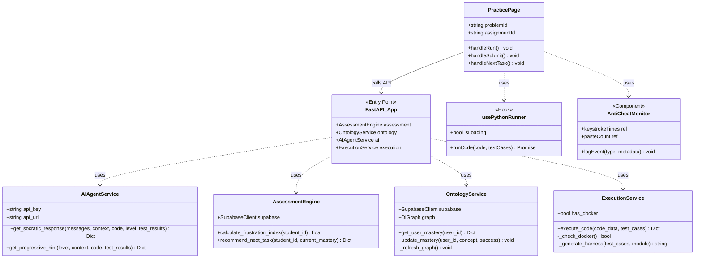

# Class Diagram: CodeCoach

This diagram illustrates the primary classes, services, and their relationships within the CodeCoach platform.

## Description of Key Classes

### Backend Services
- **`AIAgentService`**: Interfaces with Google Gemini to provide Socratic guidance and hints. It handles the prompt engineering and JSON parsing for AI responses.
- **`AssessmentEngine`**: The "brain" of the platform. It analyzes behavioral logs from Supabase to track student frustration and recommend the next task.
- **`OntologyService`**: Manages the knowledge graph of coding concepts using `NetworkX`. It calculates mastery, available topics, and locked prerequisites.
- **`ExecutionService`**: A legacy backend runner that provides Docker-based sandboxing. Note: Main production execution is now handled on the frontend.

### Frontend Components/Hooks
- **`PracticePage`**: The main IDE component. It orchestrates code editing, execution (via `usePythonRunner`), and AI chat.
- **`usePythonRunner`**: A custom hook that wraps **Pyodide**. It loads the Python runtime into a WebWorker and executes student code against test cases in the browser.
- **`AntiCheatMonitor`**: Tracks fine-grained student interactions (keystrokes, tab blurs, copy/paste) and persists them to the `security_logs` and `interaction_logs` tables for teacher review.
