# Entity Relationship Model: CodeCoach

This model describes the database schema and data relationships within the CodeCoach platform, managed by Supabase (PostgreSQL).

```mermaid
erDiagram
    USERS ||--|| PROFILES : "has one"
    USERS ||--o{ USER_ROLES : "assigned"
    USERS ||--o{ SUBMISSIONS : "makes"
    USERS ||--|| USER_POINTS : "earns"
    USERS ||--o{ USER_BADGES : "achieves"
    USERS ||--o{ ASSIGNMENTS : "receives"
    USERS ||--o{ USER_MASTERY : "tracks"
    USERS ||--o{ AI_INSIGHTS : "receives"
    USERS ||--o{ INTERACTION_LOGS : "generates"
    USERS ||--o{ SECURITY_LOGS : "generates"

    PROBLEMS ||--o{ SUBMISSIONS : "has"
    PROBLEMS ||--o{ SECURITY_LOGS : "monitors"
    PROBLEMS ||--o{ AI_INSIGHTS : "references"

    BADGES ||--o{ USER_BADGES : "granted as"

    CONCEPTS ||--o{ PREREQUISITES : "prerequisite for"
    CONCEPTS ||--o{ USER_MASTERY : "part of"
    CONCEPTS ||--o{ PREREQUISITES : "has"

    USERS {
        UUID id PK
        string email
    }

    PROFILES {
        UUID id PK
        UUID user_id FK
        string display_name
        string avatar_url
    }

    USER_ROLES {
        UUID id PK
        UUID user_id FK
        app_role role
    }

    PROBLEMS {
        integer id PK
        string title
        string difficulty
        string[] concepts
        string type
        jsonb test_cases
    }

    SUBMISSIONS {
        UUID id PK
        UUID user_id FK
        integer problem_id FK
        string code
        integer score
        integer tests_passed
    }

    ASSIGNMENTS {
        UUID id PK
        UUID student_id FK
        integer[] problem_ids
        string status
        integer time_limit
    }

    CONCEPTS {
        string id PK
        string description
    }

    PREREQUISITES {
        string concept_id PK, FK
        string prerequisite_id PK, FK
    }

    USER_MASTERY {
        UUID user_id PK, FK
        string concept_id PK, FK
        boolean mastered
    }

    USER_POINTS {
        UUID user_id PK, FK
        integer total_points
        integer problems_solved
        integer current_streak
    }

    AI_INSIGHTS {
        UUID id PK
        UUID student_id FK
        integer problem_id FK
        string user_level
        string lacking_areas
    }

    INTERACTION_LOGS {
        UUID id PK
        string student_id FK
        integer problem_id FK
        string action_type
        jsonb metadata
    }

    SECURITY_LOGS {
        UUID id PK
        UUID user_id FK
        integer problem_id FK
        string event_type
        integer wpm
    }
```

## Description of Relationships

### 1. User Core
- **`USERS` to `PROFILES`**: Each authenticated user has a corresponding profile for display properties (1:1).
- **`USERS` to `USER_ROLES`**: Users can have specific roles like `student` or `teacher`, which control access to different dashboards.

### 2. Learning & Assessment
- **`PROBLEMS` to `SUBMISSIONS`**: Students submit code for specific problems. Each submission tracks the score and test results.
- **`USERS` to `ASSIGNMENTS`**: Teachers can group specific problems into an assignment for a student.
- **`USERS` to `AI_INSIGHTS`**: Gemini generates diagnostic feedback tied to a specific student and problem pair.

### 3. Adaptive Ontology (Knowledge Graph)
- **`CONCEPTS` & `PREREQUISITES`**: A self-referencing relationship that forms the DAG (Directed Acyclic Graph) of the learning path.
- **`USER_MASTERY`**: Tracks which concepts a student has successfully unlocked and mastered.

### 4. Gamification & Tracking
- **`USER_POINTS` & `BADGES`**: Tracks the student's progression, XP, and achievements.
- **`INTERACTION_LOGS` & `SECURITY_LOGS`**: High-frequency behavioral data (keystrokes, tab blurs) used by the `AssessmentEngine` and `AntiCheatMonitor`.
