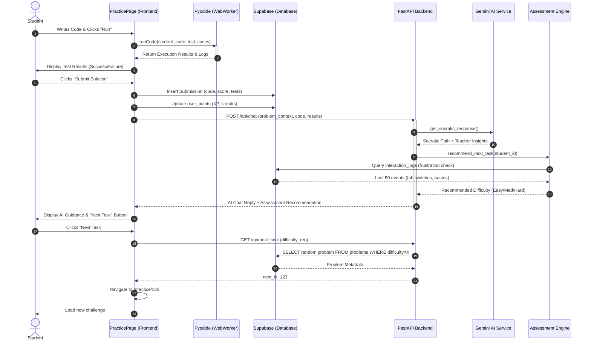

# Sequence Diagram: CodeCoach Core Flow

This diagram illustrates the dynamic interaction between the student, the browser-side execution environment, and the backend AI services during a typical coding session.

## Description of Interactions

### 1. Real-Time Execution (Steps 1-4)
- Unlike traditional platforms, CodeCoach performs initial verification entirely in the user's browser via **Pyodide**. 
- This ensures zero latency and offline capability for basic syntax and logic checks.

### 2. Submission & Feedback Loop (Steps 5-9)
- Upon submission, the frontend synchronizes with **Supabase** to persist progress.
- It then triggers the backend **Socratic Loop**. The `AIAgentService` uses Gemini to generate conversational guidance *without* giving away the solution.
- Simultaneously, the `AssessmentEngine` calculates a **frustration index** by analyzing behavioral logs (e.g., if the user was switching tabs or pasting code), which informs the next task's difficulty.

### 3. Adaptive Path Navigation (Steps 10-16)
- The backend's recommendation is translated into a dynamic navigation event.
- The platform automatically steers the student toward a challenge that matches their current cognitive load and frustration level, ensuring a "Flow" state.
